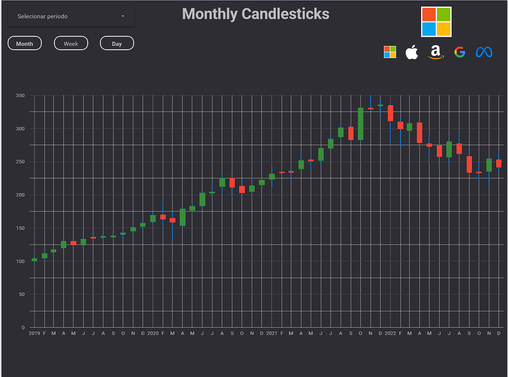

# Projeto de Portfólio: Dashboard de Preços de Ações

Este projeto consiste em um dashboard que mostra os preços das ações da Apple, Microsoft, Amazon, Google e Meta desde 2019 até 2022, com visões diárias, mensais e anuais. O objetivo é apresentar de forma clara e intuitiva as informações de desempenho dessas empresas no mercado de ações ao longo dos anos.

O projeto foi desenvolvido utilizando a linguagem de programação Python para consumir uma API de preços de ações e armazenar os dados no Google BigQuery. A visualização dos dados foi feita no Looker Studio, uma plataforma de Business Intelligence e análise de dados.

### Tecnologias Utilizadas
* Python
* API Finnhub
* Google BigQuery
* Looker Studio

<a href="https://lookerstudio.google.com/reporting/a650bf28-e033-4b94-bf2d-a55e6bbc22d5/page/EafFD">Link do Dashboard</a>
